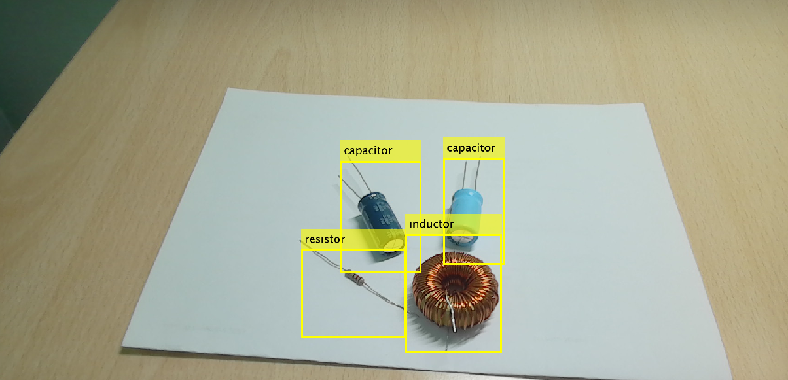
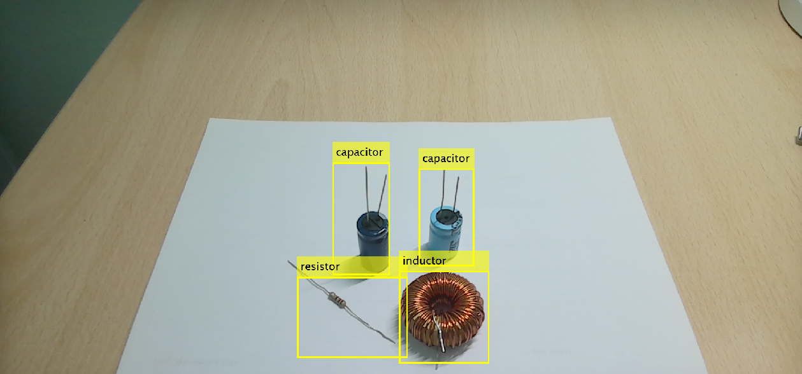

# Real-Time Detection of Electrical Components

## Project Overview

In this project, I explore the application of YOLOv4, a prominent deep learning methodology, for real-time detection and classification of electrical circuit components. Traditionally, circuit components, positioned variably in scanned images prevalent in electrical and electronics engineering, were treated individually using conventional methods. However, to enhance efficiency, I leveraged the **You Only Look Once (YOLOv4)** approach for object detection. YOLOv4, designed for rapid object detection and classification, minimizes the need for extensive image data preprocessing and automates the feature extraction phase.

## Objective

My objective was to achieve precise detection and classification of three distinct circuit components:
- **Resistor**
- **Inductor**
- **Capacitor**

These components were identified within circuit images using the YOLOv4 model, implemented with the MATLAB programming language.

## Methodology

1. **Dataset Creation**: To train the model, I curated a dataset comprising 400 images of circuit components.
2. **Model Fine-Tuning**: I applied fine-tuning and adjustments to a pre-trained YOLOv4 model, following the guidelines from the MATLAB documentation repository ([MATLAB YOLOv4 Pre-trained Models](https://github.com/matlab-deep-learning/pretrained-yolo-v4)), to customize the network for specific detection needs.
3. **Training**: The training process spanned 90 epochs, with iterative adjustments to optimize model performance for precise detection across varied positions of circuit components.

## Results

The trained YOLOv4 model demonstrated swift, high-performance detection of circuit components in real-time, effectively handling various component positions within scanned circuit images. This project highlights the efficiency and effectiveness of YOLOv4 for real-time detection applications in electrical circuit analysis.

## Conclusion

This project showcases the potential of YOLOv4 for rapid, accurate detection of electrical components, presenting a valuable tool for real-time analysis in electrical and electronics engineering applications.

## Demonstrative Images of Real Detection by the Custom Trained Model

